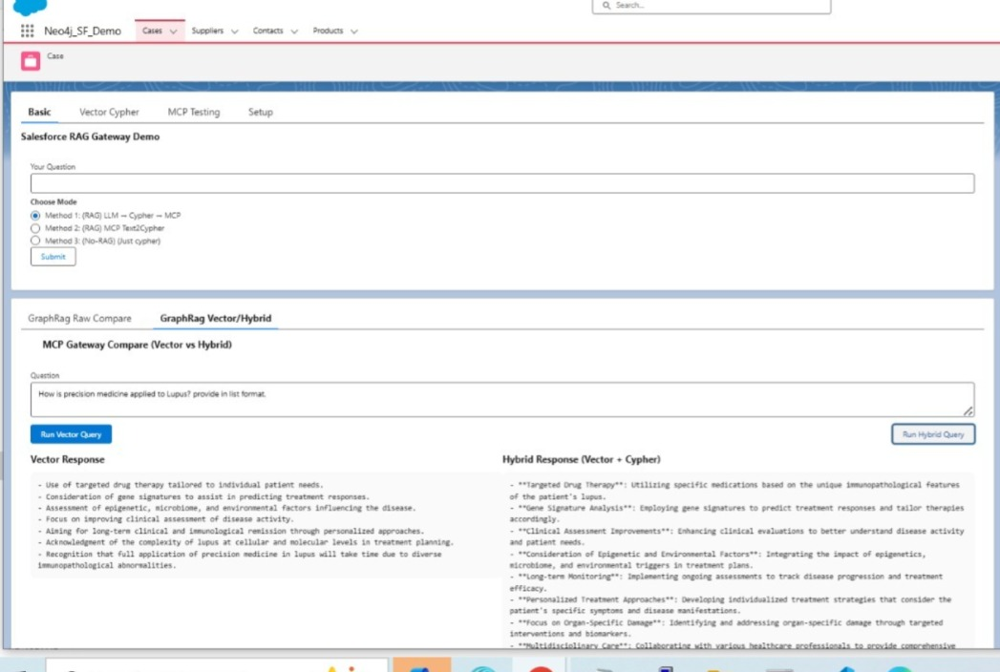

# Salesforce–Neo4j Integration using MCP & GraphRAG  
[](LICENSE)  
  

## Table of Contents  
- [Project Overview](#project-overview)  
- [Key Technologies](#key-technologies)  
- [Architecture & Methods](#architecture--methods)  
  - Method 1: Manual Cypher RAG  
  - Method 2: Retriever RAG  
  - Method 3: No-RAG  
  - Method 4: GraphRAG Pipeline  
- [Demo / Screenshots](#demo--screenshots)  
- [Getting Started](#getting-started)  
  - Prerequisites  
  - Setup & Installation  

- [License](#license)  
- [Contact](#contact)  

---

## Project Overview  
This repository demonstrates an integration between **Salesforce** (CRM platform) and **Neo4j** (graph-database) using the **Model Context Protocol (MCP)**, incorporating the concept of **GraphRAG** (Graph-based Retrieval-Augmented Generation).  
The goal is to enable Salesforce to leverage graph-based insights (via Neo4j) for enhanced customer, case, or relationship analytics — such as multi-hop queries, similarity search and semantic understanding of data relationships.

This project showcases four distinct integration methods, leveraging Apex, LWC, and Named Credentials within Salesforce, and querying Neo4j via MCP servers — staying entirely within the Salesforce and Neo4j ecosystem.

---

## Key Technologies  
- **Salesforce**: Apex, LWC, Named Credentials, Flow automation  
- **Neo4j**: Graph modelling (nodes, relationships, properties), Cypher query language  
- **Model Context Protocol (MCP)**: Standardized protocol connecting AI models to tools and databases  
- **GraphRAG**: Combines vector embeddings + graph context for richer retrieval and insights  

---

## Architecture & Methods  

### Method 1: Manual Cypher RAG  
**Flow:** Salesforce → MCP Gateway → Neo4j (manual Cypher queries)  
**Highlights:** Developer writes Cypher queries manually; best for full  control over grounding.  


### Method 2: Retriever RAG  
**Flow:** Salesforce → Gateway -> Retriever → Neo4j  
**Highlights:** Converts natural language to Cypher via retriever. Then use that for grounding.  


### Method 3: No-RAG Integration  
**Flow:** Salesforce → MCP Gateway → Neo4j (direct structured calls)  
**Highlights:** No grounding layer; Just the cypher query is used 


### Method 4: GraphRAG Pipeline  
**Flow:** Salesforce → GraphRAG Pipeline → Neo4j  
**Highlights:** Combines vector + graph context; provides context-rich insights for knowledge graph use cases.  


**Reference:**

https://neo4j.com/docs/neo4j-graphrag-python/current/user_guide_kg_builder.html (KG pipeline)
https://github.com/neo4j-product-examples/graphrag-python-examples (Example used)
https://neo4j.com/blog/genai/what-is-graphrag/ (Documentation)
https://neo4j.com/blog/news/graphrag-python-package/ (Explanation of example)
https://neo4j.com/docs/neo4j-graphrag-python/current/user_guide_rag.html


## 🏗 Architecture Overview

| Layer | Component |
|-------|----------|
| UI Layer | **Lightning Web Component (LWC)** |
| Backend (Salesforce) | **Apex Controller → Named Credentials → HTTP Callouts** |
| Gateway | **Node.js MCP Client Gateway (Port 9005)** |
| MCP Services | **Python MCP Server (Port 8005)** exposing tools
| Data Layer | **Neo4j Graph Database** |

- LWC sends requests → Apex  
- Apex uses **Named Credentials + ngrok HTTPS endpoint**  
- Node.js Gateway converts Salesforce HTTP into MCP requests  
- Python MCP Server hosts tools that translate or execute Cypher


## 🎛 Why Apex + Named Credentials?

Salesforce **does not allow direct HTTP calls from LWC** due to security policy. So:

- **Apex makes the callout**
- **Named Credential exposes the gateway URL**
- **Ngrok provides temporary HTTPS URL**, because Named Credentials **do not accept HTTP**


---
## 🌍 Testing via cURL

**Local testing** Vector-only query
```bash
curl -s -X POST http://localhost:8005/mcp -H "Content-Type: application/json" -H "Accept: application/json,text/event-stream" -d '{
  "jsonrpc":"2.0","id":3,"method":"tools/call",
  "params":{"name":"run_vector_query","arguments":{"question":"Summarize communication challenges between patients and clinicians"}}
}'


```

**Remote testing**
```bash
curl -s -X POST https://d001d4abfaa9.ngrok-free.app/mcp -H "Content-Type: application/json" -H "Accept: application/json,text/event-stream"  -d  @biomolecule.json


```

**Input JSON (`biomolecule.json`)**
```json
{
  "jsonrpc":"2.0","id":4,"method":"tools/call",
  "params":{"name":"run_graphrag_search_withcontext","arguments":{"question":"Relate biomolecule findings to lupus clinical guidelines"}}
}

```
---

## Demo / Screenshots  

1. **Salesforce Application :** 


2. **Vector query:** 

3. **Vector vs Vector cypher :** With GraphRag comparison



---

## Getting Started  

### Prerequisites  
- Salesforce Developer Org or Sandbox  
- Neo4j database (local or Aura)  
- Node.js for MCP Gateway or Python for MCP Server  
- Basic knowledge of Apex, LWC, Cypher  

### Setup & Installation  
```bash
git clone https://github.com/belavaditech/Salesforce-MCP-GraphRag-Neo4j.git
cd Salesforce-MCP-GraphRag-Neo4j
```

1. Configure Neo4j connection credentials.  
2. Setup MCP server (Provided ) with Neo4j details.  
3. Setup Gateway server (Provided)
4. Create 2 Named Credentials in Salesforce for secure endpoint calls.  
5. Deploy provided Apex classes (one for MCP server endpoint 8005, another for Gateway endpoint access 9005)
6. Deploy LWC components (provided).  
7. Configure the LWC components in your application

---

---

## Configuration  

Create a `.env` file for your environment:  
```env
NEO4J_URI=bolt://localhost:7687
NEO4J_USER=neo4j
NEO4J_PASSWORD=your_password
MCP_PORT=8005

```

In Salesforce:  
- Set up a **Named Credential** pointing to the MCP Gateway endpoint.  
- Assign permission sets for API calls from Apex.  

---


---

## License  
This project is licensed under the MIT License — see [LICENSE](LICENSE).  

---

## Contact  
**Author:** Ramesh BN  

---

**Happy Graphing and Integrating! 🚀**
